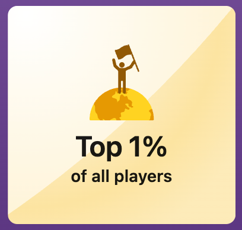

# LinkedIn Queens Solver

The code for this evening of work can be found [here](https://github.com/mattcoptimization/linkedin_games) on my GitHub.

Over the last few weeks, I have found myself wasting a whole 2-3 minutes a day solving the LinkedIn Queens daily game. 
Following in the footsteps of the New York Times, LinkedIn has attempted to boost daily engagement by providing daily "challenges".
Somewhere along the way, I became curious. 
Could I solve this using mathematical optimization? What about using constraint programming?
I had also recently learned how to use the library `playwright`. 
Traditionally used for testing web interfaces, it can also be used to script web interactions in real world websites.
Famously, the Rabbit R1 "Large Action Model" (their words, not mine) [used an LLM to invoke pre-written scripts](https://ainiro.io/blog/rabbit-r1-textbook-ai-based-pump-and-dump).

## The Game


The [Queens Game](https://www.linkedin.com/games/queens/) has 3 main rules:

1. Each unique color region must have exactly one queen.
2. Each row and column must have exactly one queen.
3. Queens cannot directly border one another (think a king in a game of Chess)

Simple, right?

Let's solve this "the normal way".

On the left hand side, two columns share two colors. This means that the other colors cannot have a queen. We combine rules 1 and 2 above to say that no queens can be in the first or second column for light blue and red. 


On the right hand side, red is the only available color. This means the rest of the red should be blocked out.


In the middle, the yellow row means that no other color can have a queen in that row. This is the only option for the yellow color.


We keep going, combining constraints until only one solution is possible.
If we solve fast enough, we get a flashy solution screen! 
We get to compare ourselves to our peers. 
How many CEOs am I "smarter" than? Where do I fall in the LinkedIn hierarchy?

After two weeks of solving these puzzles, I decided I was tired of being in the middle 50% of solve times.
As Ash Ketchum would say, I want to be the very best.
And I'm going to use programming and optimization to cheat.

## The Model

For this problem, I decided to use Google's CP-SAT solver in ORTools? 
Could I have used a traditional IP solver?
Yes.
Why did I use this one?
Honestly, just because I don't have a ton of experience with SAT solvers.
I wanted to try out the solver interface.

For those unfamiliar, constraint programming focuses on problems where all variables are integers.
In mathematical optimization, variables are decisions to be made by the model, constraints are restrictions
placed on the variables in these problems, and parameters are fixed values given in the problem statement.

Lets define each of these for our problem:
1. Variables: Whether or not a specific cell has a queen. This means we have NxN number of variables. If 0, the cell does not have a queen. If 1, the cell does have a queen.
```python
{(i,j): model.NewBoolVar(f"queen_{i}_{j}") for i in range(n_size) for j in range(n_size)}
```
2. Parameters: The color of each cell. For efficiency reasons later, it is best to store this in a dictionary of `{color: [list_of_cells_of_that_color]}`
3. Constraints. Here is where things get a little more complicated:
    * One queen per row
    * One queen per column
    * No adjacent queens
    * One queen per color

We can represent these in LaTeX below:

#### Variables
- $x_{i,j} \in \{0, 1\}$ for $i, j \in \{1, 2, ..., n\}$
  - $x_{i,j} = 1$ if there is a queen at position $(i,j)$
  - $x_{i,j} = 0$ otherwise

#### Parameters
- $n$: size of the grid (n × n)
- $C_k$: set of cells belonging to color $k$
- $K$: set of all colors

#### Constraints

1. One queen per row
$$\sum_{j=1}^{n} x_{i,j} = 1 \quad \forall i \in \{1, 2, ..., n\}$$

2. One queen per column
$$\sum_{i=1}^{n} x_{i,j} = 1 \quad \forall j \in \{1, 2, ..., n\}$$

3. One queen per color region
$$\sum_{(i,j) \in C_k} x_{i,j} = 1 \quad \forall k \in K$$

4. No adjacent queens (diagonal constraint)
$$x_{i,j} + x_{i+1,j+1} \leq 1 \quad \forall i \in \{1, 2, ..., n-1\}, j \in \{1, 2, ..., n-1\}$$

$$x_{i,j} + x_{i+1,j-1} \leq 1 \quad \forall i \in \{1, 2, ..., n-1\}, j \in \{2, 3, ..., n\}$$

>Note: The horizontal and vertical adjacency constraints are implicitly satisfied by constraints 1 and 2, since each row and column can have exactly one queen.

Since this is a feasibility problem, we don't need an objective function. We simply need to find any feasible solution that satisfies all constraints.

## Coding the Model

Now that we have our problem, we can write it out fully in code like the following: 

First, the row and column constraints. We must have exactly one queen in each row and column.
```
_ = {i: model.AddExactlyOne((queen_vars[i,j] for j in range(n_size))) for i in range(n_size)}

_ = {j: model.AddExactlyOne((queen_vars[i,j] for i in range(n_size))) for j in range(n_size)}
```

Next, the diagonals. Note that the neighboring constraints in the vertical and horizontal direction are handled by the 
other constraints directly above.
```
# Constraint: No queens on neighboring diagonals
directions = [(1, 1), (1, -1)]

# Solve the diagonals, we only go down and iterate one at a time.
for i in range(n_size):
    for j in range(n_size):
        for di, dj in directions:
            ni, nj = i + di, j + dj
            if 0 <= ni < n_size and 0 <= nj < n_size:
                model.AddAtMostOne([queen_vars[(i, j)],queen_vars[(ni, nj)]])
```
Now, the color constraints. Due to our formulation, this constraint is actually pretty simple to write. All we need to do is say that each color group should have exactly one queen inside:

```
    for color_idx, positions in queens_table.colors.items():
        # Sum all boolean variables in this color region and set to 1
        color_queens = [queen_vars[pos] for pos in positions]
        model.AddExactlyOne(color_queens)
```

At the end of the day, we have a very simple set of constraints. The full code can be found on my GitHub here for people to play with. 


> A note for mathematical optimization experts. If you have solved the N-Queens problem before, you'll notice that my formulation doesn't have the typical "value of queen is column and index is the row". This is due to the color constraints. I couldn't figure out a way to solve for these constraints without some additional boolean variables. Let me know [here](mailto:emaxoptimization@gmail.com) if you find a way to solve this. I would be happy to add a follow-up post.

## The Script

To solve the puzzle as fast as possible, I would rather not have to get all of the parameters myself! 
That would defeat the whole point.
I chose to use PlayWright, a library usually reserved for unit testing or integration testing of front-end interfaces.
This is mainly because I was loosely familiar with the library and didn't feel like learning another library
on a Saturday evening.


### Signing In

First, we need to solve for the login page. Provided I don't get a Captcha (LinkedIn, plz don't ban), I can just select the username and password fields by label, click them, and fill them out. 
I chose to use environment variables to store my password. Very bad practice, yes. But also, I didn't feel like setting up a whole security apparatus to get a 100 line script working.

```python
def linkedin_login(page: Page) -> None:
    """Uses playwright to pass the login screen of linkedin.
    
    NOTE: Must set env vars of LINKEDIN_USERNAME and LINKEDIN_PASSWORD.
    """
    username_field = page.get_by_label("Email or phone")
    username_field.click()
    username_field.fill(value=os.getenv("LINKEDIN_USERNAME"))
    sleep(1)
    password_field = page.get_by_label("Password")
    password_field.click()
    password_field.fill(value=os.getenv("LINKEDIN_PASSWORD"))
    sleep(1)
    # Sign in button class has duplicate label
    sign_in_button = page.locator('.btn__primary--large.from__button--floating')
    sign_in_button.click()
    sleep(5)
```

Note the use of the locator at the bottom. Unfortunately for me, LinkedIn also has a "Sign In Button" for Google account connections, creating a duplicate label.

### Reading the Puzzle

For reading the puzzle, I can just use the ID given by LinkedIn, called the "queens-grid" in the DOM. 
Then, I just read in every element with the class "queens-cell-with-border".
LinkedIn uses [row-major](https://en.wikipedia.org/wiki/Row-_and_column-major_order) indexing, so I can use 
integer divisors and modulus to find the row and column, respectively.
I then parse the other class to find the color index, and I store this in the array I mentioned above!
Pretty simple.

```python
def read_queens_table(page: Page) -> QueensTable:
    """Use playwright to read the table into the pydantic structure."""
    # Get the grid
    # Get by ID, grid contaisn all elements
    grid_element = page.locator("#queens-grid")

    table = QueensTable()

    # Get the number of rows
    rows_and_columns = grid_element.get_attribute("style")
    # The format is --rows: 9; --columns: 9
    # It is a square, so we just use regex to get rows
    pattern = r'--rows:\s*(\d+);'
    rows_match = re.search(pattern, rows_and_columns)
    if rows_match:
        n_rows = int(rows_match.group(1))
    
    # Get all of the cells and store
    all_cells = grid_element.locator(".queens-cell-with-border")

    # Iterate over cells
    for cell_number in range(all_cells.count()):
        element = all_cells.nth(cell_number)
        # Row major order
        row = cell_number // n_rows
        col = cell_number % n_rows
        # Get the class
        total_string = element.get_attribute("class")
        # Find the color index using regex
        color_idx = int(re.search(r"cell-color-(\d+)", total_string).group(1))

        if not color_idx in table.colors:
            table.colors[color_idx] = []
        # Store
        table.colors[color_idx].append((row, col))
        
        
    return table
```

> Another note for experts. The above is super slow. The best speedup here would be achieved by directly using Javascript to output and parse the class names. For simplicity, I chose the slower method. I can potentially return to this implementation in the future.

### Solving and Returning Results

To solve the puzzle, I simply pass my model to Google's CP-SAT solver, and Solve!

Google uses dependency injector to separate the solver from the model. I don't necessarily agree with this (some libraries use a different pattern), but I digress.

```
solver = cp_model.CpSolver()
status = solver.solve(model)
```

Once I have solved the model, I can parse the results and use playwright to interact with the puzzle. 

Variables can be accessed from the Solver object using value. Note the coupling of the variables between the Solver and Model objects, which is why I disagree with this design:

```python
 queens_table.solution.extend([Position(row=i, col=j) for i in range(n_size) for j in range(n_size) if solver.Value(queen_vars[i,j]) == 1])
```

Playwright can find the relevant cells and click them to add a queen. Now that we have all of our queen coordinates, all that's left is to persist the results!

```python
for pos in queens_table.solution:
    cell_index = pos.row * n_size + pos.col

    cell = grid_element.locator(".queens-cell-with-border").nth(cell_index)

    cell.click()

    sleep(0.2)
    
    cell.click()
```

Upon completion, the queens puzzle automatically flashes and shows completion.
Great success!


## Conclusion

After an evening of work, LinkedIn is telling me that I am in the top 1% of all solvers on the site.



Interestingly, I am only in the top 25% of all of my connections. Apparently, I am not the first person to automate this. Looking at you, all of my decision science connections!


Somehow, I need to be just a little bit faster.

I solved in 8 seconds, the vast majority of which was taken up by playwright reading the puzzle. 


Next up, the LinkedIn Tango game! It is quite similar to this, and I can use a similar methodology to solve.